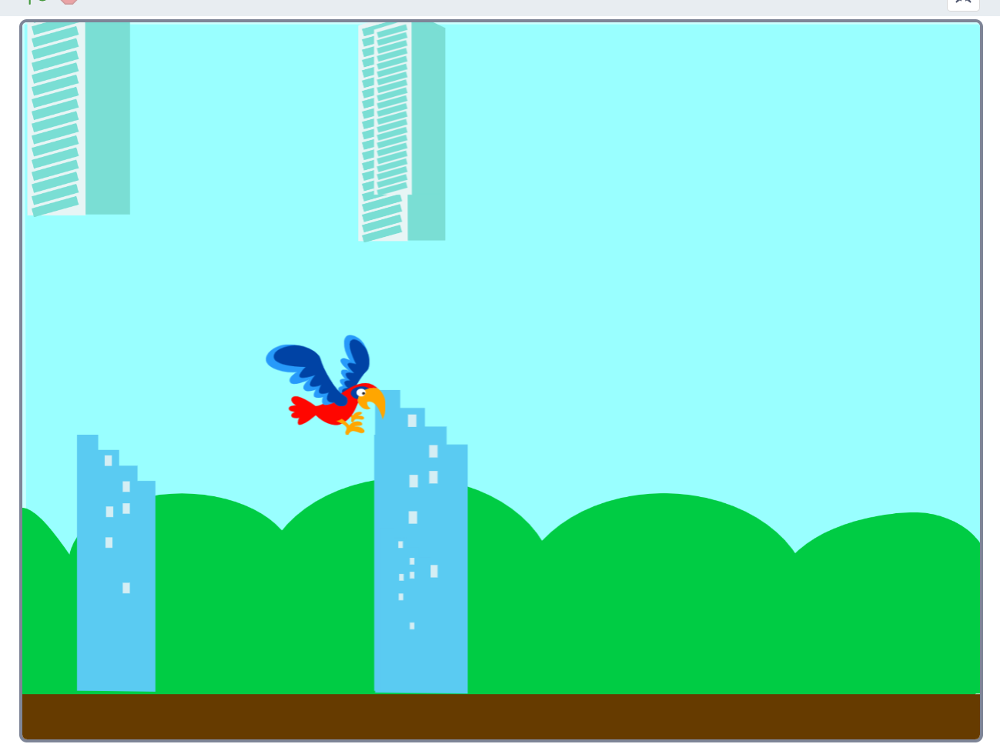

## Practice Statement - The Flying Bird 
 
**This game is about some obstacles moving slowly towards a flying bird. The objective of the game is to help the bird escape the obstacles appearing on its way. The player has to use the up and down arrow keys of the keyboard to control the flight of the bird. If the flying bird overcomes 20 obstacles, the player wins the game. However, if the flying bird crashes into an obstacle, the player loses the game.**

 
    a.  Write an algorithm to create this game.
    b.  Write its corresponding pseudocode.
    c.  Create a Scratch program for the game. Make sure that the flight of the bird looks realistic.

**Sample Output**

