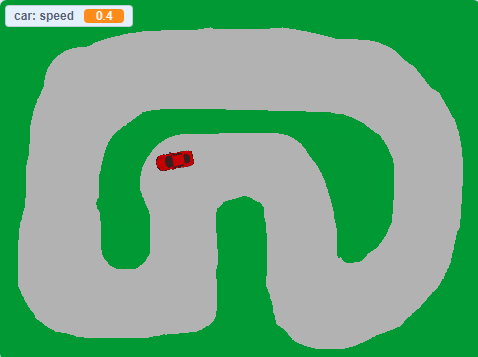

## Practice Statement - Racetrack

**Create a racetrack game with a closed track having multiple bends. The purpose of this game is to control the direction of the car so that it stays on the track. The player has to use the left arrow key to turn the car in anticlockwise direction and the right arrow key to turn the car in clockwise direction. To control the speed of the car, the player has to use the up and down arrow keys. If the car runs off the track, the player is allowed to continue; however, the speed of the car is reduced to zero as a penalty. The player can increase the speed of the car to re-enter the track.**
 
    a.  Write an algorithm to create this game.
    b.  Write its corresponding pseudocode.
    c.  Write a Scratch program to create the game. Use the drawing tool to create a racetrack backdrop having a closed track with one lane. Use only one car to keep the game simple and resize the car sprite to fit your track.

**Sample Output**

