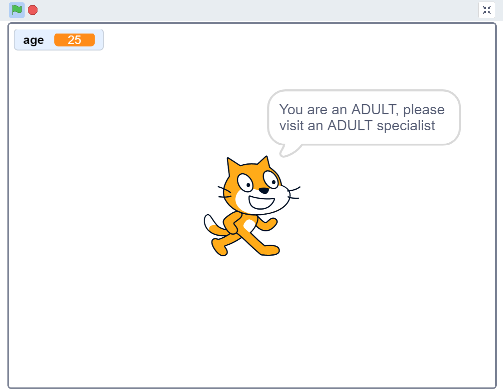

## Practice Statement - Age Categorization

**At a multidisciplinary health clinic, different consultants are responsible for attending patients of different age groups.​

Write a program that accepts the age of a patient and categorizes the patient as a child (<13), a teenager (>=13 but <20), or an adult (>=20). ​

The age should only include the number of completed years.​

​**

	a.Write an algorithm to solve the problem.
	b.Draw its corresponding flowchart using the Raptor tool.
	c.Write its corresponding pseudocode.
	d.Create a Scratch program using the flowchart drawn.

**Sample Output**

